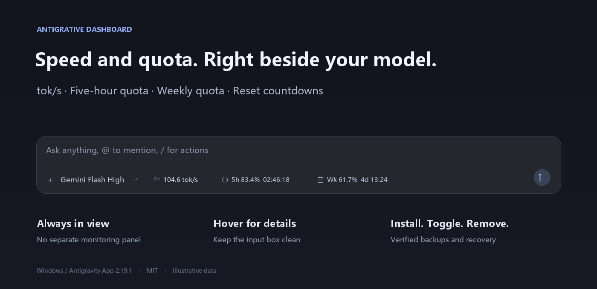
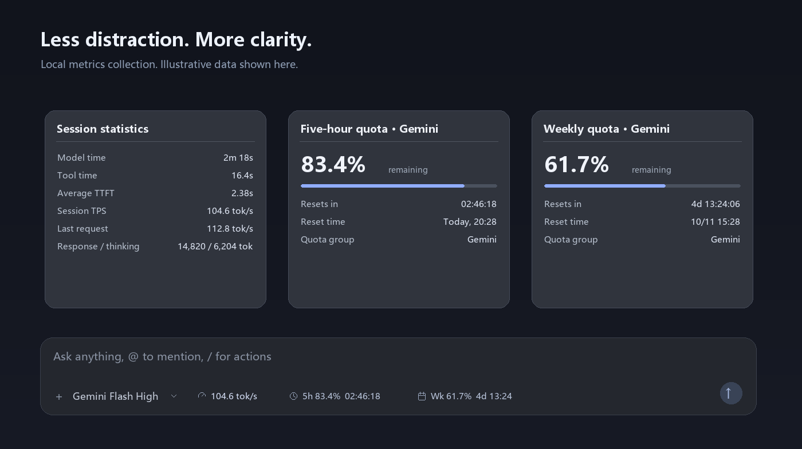

<div align="center">



# Antigrative Dashboard

Token throughput, five-hour quota, and weekly quota — in the model selector row.<br>
Keep the summary visible. Hover for the details.

[](CHANGELOG.md)
[](COMPATIBILITY.md)
[](COMPATIBILITY.md)
[](LICENSE)

[Preview](#preview) · [Install](#install) · [Enable or remove](#plug-and-unplug) · [Compatibility](#compatibility) · [FAQ](#faq) · [中文](README.zh-CN.md)

</div>

## Preview



<sub>Artwork uses illustrative data, not real account quotas or conversations. The installed widget reads metrics from your local Antigravity app. Its current in-app labels are Chinese; the English artwork illustrates the layout.</sub>

**Keep working. The numbers are already there.**

| See the speed | Know your quota | Stay focused |
| --- | --- | --- |
| Weighted session TPS, last-request TPS, model and tool time, and time to first token. | Separate Gemini and Claude/GPT quota groups, with five-hour and weekly reset countdowns. | One compact strip beside the model selector. Hover for details; unused TPS stays hidden in new chats. |

### Small details that matter

- **Stable menus.** Quota-group menus stay open across polling cycles while countdowns continue ticking.
- **Actual account data.** Remaining quota comes from the account API, not an estimate based on text length. Expired windows do not automatically become 100%.
- **Conversation-aware.** Switch chats without carrying the previous chat's throughput into a new one.
- **Reversible.** Disable hides the strip. Uninstall restores the verified original application archive.
- **Compact-window support.** Summary countdowns hide when space is limited; full countdowns remain available in hover cards.
- **Local collection.** The collector talks to loopback endpoints. It does not upload your metrics to a third-party service.

## Install

Supported: **Windows, Antigravity desktop App 2.19.1, Python 3.10+**. No third-party pip or npm packages are needed to install or run the plugin. The sidecar uses the app's bundled Node.js runtime. See [COMPATIBILITY.md](COMPATIBILITY.md).

> The inline model-row position has no public plugin mounting API. This project combines a standard Antigravity sidecar plugin with a reversible local loader adapter. Installation modifies three loading files inside `resources/app.asar` and keeps an integrity-checked backup. It is unofficial and version-specific; compatibility after an app update is not guaranteed.

Download the ZIP from the [latest release](https://github.com/YOU-SHOULD-KNOW-ME/antigrative-dashboard/releases/latest), extract it to a permanent folder, or clone the repository:

```powershell
git clone https://github.com/YOU-SHOULD-KNOW-ME/antigrative-dashboard.git
cd antigrative-dashboard
python manage.py install
```

Fully quit and reopen Antigravity. Open a conversation: the strip appears beside the model selector. PowerShell users can also run `./install.ps1`.

The installer validates the app version, copies the plugin, backs up the archive, applies the adapter, and enables the plugin. It does not upgrade or replace an unsupported app. **Keep the extracted source folder** for enable, disable, update, and uninstall commands.

<details>
<summary><strong>Ask an agent to install it</strong></summary>

```text
Install and enable Antigrative Dashboard on this computer.
Repository: https://github.com/YOU-SHOULD-KNOW-ME/antigrative-dashboard
Goal: show tok/s, five-hour quota and reset countdown, and weekly quota and
reset countdown in the Antigravity model selector row.

1. Read README.md and COMPATIBILITY.md. Verify Windows, Antigravity desktop
   App 2.19.1, and Python 3.10+. Do not upgrade, downgrade, or replace my app.
2. Clone or extract the project to a permanent directory.
3. Inspect python manage.py status, then run python manage.py install.
   Preserve other plugin settings and use the built-in backup validation.
4. Fully restart Antigravity. If a task is running, report the required
   restart and do not forcibly interrupt it.
5. Verify new-chat quota, existing-chat TPS, and hover cards. Leave the
   quota-group menu open across several polls and confirm it stays open.
6. Report the app version, installation result, backup path, and what was
   actually verified on this machine.
```

</details>

## Plug and unplug

Run these commands from the project directory:

| Action | Command | What happens |
| --- | --- | --- |
| Install or update | `python manage.py install` | Validate, back up, apply the adapter, preserve other settings |
| Disable | `python manage.py disable` | Disable the plugin and hide the strip on its next poll |
| Enable | `python manage.py enable` | Start the plugin and show the strip again |
| Inspect | `python manage.py status` | Check installation, enabled state, and archive recovery |
| Uninstall | `python manage.py uninstall` | Restore the verified archive and remove this plugin |

First installation, a loader update, and uninstall require a full app restart. Enable and disable do not require reinstalling or rewriting the archive. `./uninstall.ps1` runs the uninstall command.

**Recovery files stay available.** Original archives live in `%LOCALAPPDATA%/AntigravityPulseBackups/<timestamp>/`. Uninstall retains backups and diagnostic logs. If the archive has unknown modifications, the uninstaller refuses to overwrite it.

`python manage.py install --panel-only` installs the sidecar without modifying the loader. It requires native UI Extensions to be available on the account and does not provide the inline strip.

The stable internal plugin ID remains `antigravity-pulse` for compatibility with earlier installations. The public project name is **Antigrative Dashboard**.

## How the numbers work

| Metric | Definition |
| --- | --- |
| Session TPS | Sum of response tokens from valid requests divided by their total streaming duration |
| Last-request TPS | Response tokens divided by streaming duration for the latest valid request |
| TTFT | Average time to first token; excluded from response streaming TPS |
| Model time | TTFT plus streaming duration across requests |
| Tool time | Union of tool execution intervals; overlapping time counted once |
| Five-hour / weekly remaining | Account-provided `remainingFraction`; not a currency balance |
| Reset countdown | Account-provided `resetTime` minus the current time |

Request metrics update after requests finish, with a poll about every 2.2 seconds. This is not a per-token instantaneous speed meter. Quotas refresh every 60 seconds; countdowns tick every second.
Thinking tokens are separate. If a model does not expose response tokens, the detail card explains the all-output fallback. Requests without valid timing do not contribute to TPS. Missing or disconnected data is labeled accordingly.

## Compatibility

Verified on **Windows 11 / Antigravity desktop App 2.19.1**. Not an Antigravity IDE, VS Code, or DSH extension. macOS and Linux are not adapted.
Repository presentation is inspired by [DSH Rail Music](https://github.com/YOU-SHOULD-KNOW-ME/dsh-rail-music); installation APIs differ. `dsh plugin add` cannot install this project.

[Full compatibility and recovery details →](COMPATIBILITY.md)

## FAQ

<details><summary><strong>The strip did not appear after installation.</strong></summary>

Fully quit the main app process and reopen it. Run `python manage.py status`. Inspect `~/.gemini/antigravity/sidecar_data/antigravity-pulse/panel/logs/sidecar.log` and `widget.log`. Review raw host logs for local information before publishing them.

</details>

<details><summary><strong>Why is TPS missing in a new conversation?</strong></summary>

There are no request metrics yet. TPS is hidden instead of showing the previous chat's speed. It appears after a model response finishes.

</details>

<details><summary><strong>Why do Gemini and Claude/GPT have different quotas?</strong></summary>

The service returns independent groups. The default follows the selected model. Inspect another group from a quota card; an explicit label prevents confusion after manually selecting a different group.

</details>

<details><summary><strong>What happens after an Antigravity update?</strong></summary>

An update may replace the adapter. Check compatibility before reinstalling; do not overwrite a newer app with an older backup. The installer refuses unknown versions.

</details>

## Development and releases

```powershell
npm test
python -m unittest discover -s tests -v
python manage.py package
```

ZIP and SHA256 files are generated in `dist/`. Packaging uses an allowlist and excludes credentials, account settings, logs, SDK caches, and application archives.
Generating the illustrative README images is an optional developer task requiring Pillow and Windows fonts; it is not an installation dependency.

[Development guide →](docs/DEVELOPMENT.md) · [Changelog →](CHANGELOG.md)

## License

Source is available under [MIT](LICENSE). Antigravity binaries, SDK resources, and application backups are not distributed. Product names belong to their respective owners; this project is not affiliated with or endorsed by Antigravity.
