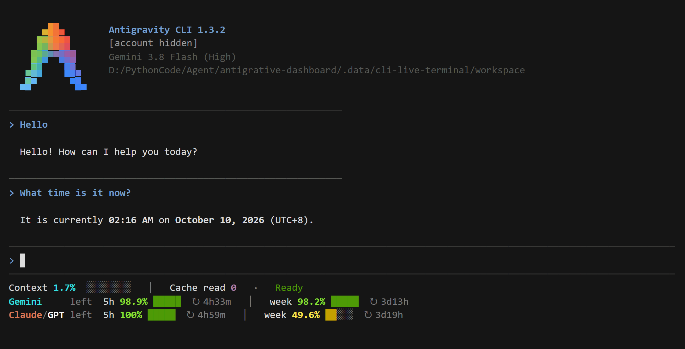

# Antigravity CLI status line

[English](#english) · [简体中文](#简体中文)

## English

The adapter uses the [official statusLine contract](https://antigravity.google/docs/cli/statusline/): the CLI sends JSON to stdin and displays formatted stdout. It requires **Node.js 20+**, **Python 3.10+** for installation and an Antigravity CLI supporting this interface. Windows, Linux and macOS share the code. It does not patch either application binary.

### Install and preview

Included in v0.6.0 and later release ZIPs. Download the package from [GitHub Releases](https://github.com/YOU-SHOULD-KNOW-ME/antigrative-dashboard/releases), extract it, then run the commands below from the extracted project directory.



Real Windows CLI 1.3.2 session, with the account email masked: context changed from 0% to 1.7% after two replies; the supplied cache read count was 0 and Claude/GPT weekly balance was 49.6% (yellow). The screenshot is live terminal output, not synthetic preview data.

Install `agy` using the [official instructions](https://antigravity.google/docs/cli/install/), then run these commands in the project directory. Linux/macOS: use `python3` instead of `python`.

```sh
node cli/statusline.mjs --preview --language en --no-color
python manage.py install-cli
python manage.py status-cli
```

Reopen `agy`. Installation copies a standalone runtime into `~/.gemini/antigravity-cli/antigrative-dashboard/` and updates only `statusLine` in `~/.gemini/antigravity-cli/settings.json`. Desktop installation is not required; desktop uninstall does not remove the CLI adapter. The runtime lives in a user directory and survives CLI binary updates. Future incompatible payload/invocation changes may still require adaptation.

An independent language choice can be saved in the command:

```sh
python manage.py install-cli --language zh-CN
python manage.py install-cli --language en
```

Without `--language`, every invocation reads the desktop plugin's persisted `AntigravityPulse/preferences.json`, falling back to English. `--node /absolute/path/to/node` overrides Node on PATH. Reinstall upgrades the code while retaining the original status line for restoration. Unrelated CLI settings are preserved. Shell invocation is tested with spaces, Chinese characters and ampersands. Windows uses a quote-free PowerShell encoded invocation to survive agy's Go/CMD command transport, sets UTF-8 for redirected input/output, and quotes paths as literal strings. This adds a short PowerShell startup per refresh; it avoids CMD percent/delayed expansion. Encoding is for transport, not encryption, and contains only executable/script paths and the language option.

### Display and semantics

| Field | Source and boundary |
| --- | --- |
| Model / state | Active model label and known `agent_state` |
| Context | Explicit `used_percentage`, or complement of valid `remaining_percentage`; never cumulative input/output counters |
| Cache read | Current `cache_read_input_tokens`; a count, not an inferred cache hit ratio |
| Quota | Supplied bucket IDs and remaining fraction; no guessed model family or reset schedule |
| Reset | Absolute reset time, falling back to supplied reset seconds; an elapsed reset does not force 100% balance |

Missing is `--`; zero stays zero. Context compaction can lower the percentage. The first row prioritizes context occupancy and cache reads with bold cyan/purple values, then agent state if it fits. Known Gemini and Claude/GPT quota buckets each occupy a separate row, placing 5h and weekly windows together. The active model family appears first; unknown bucket IDs keep their supplied identity. Remaining quota numbers and bars are green at 70% or above, yellow from 30% up to (but not including) 70%, red below 30%. Red quotas also have a textual `!` so alerts survive monochrome display. Context turns amber at 60%, red at 90%, with `!` at 90%.

Normal output uses at most three lines; wider terminals add progress bars with muted empty tracks. Countdown text is secondary (`↻` means reset). The layout drops countdowns and bars before truncating narrow rows. Extra quota buckets are indicated with an ellipsis/count where room permits. The native CLI header already shows the model; the custom status line avoids repeating it, while `--details` adds a fourth line for model, capacity and current input/output/cache creation counts. `--width 55` previews a narrow terminal.

Only foreground ANSI colors and text weights are set, allowing light/dark terminal backgrounds. `--no-color`, `NO_COLOR` and `TERM=dumb` disable colors. Automation shells commonly set the last two; a real terminal must not inherit those flags if color is wanted. No system environment variables are changed by installation. Chinese/emoji/grapheme cell widths are handled when truncating labels.

The shared `Claude/GPT` quota label uses **Claude #DA7756** and **GPT #F8FAFC** separately, with a muted slash; the supplied balance is still one shared bucket, not two independent quotas. If the terminal supplies a `COLORFGBG` light-background hint ending in palette index 7 or 15, GPT uses the terminal's default foreground instead of white. Without that hint, a light terminal can use `--no-color`. Exact RGB colors require a true-color terminal. Quota numbers and bars keep the remaining-balance thresholds.

**tok/s is unavailable:** the documented input has no streaming duration. Status-line invocation intervals, tool duration and request wall time cannot substitute for it. Cache ratio is also omitted because the documented CLI input-token semantics do not establish the desktop denominator.

No network, background polling, transcript reading, account persistence or new metric history files are used. Resumed statistics depend on the current CLI payload; missing data cannot recover from another conversation, model, account or the desktop history store. `--json` outputs normalized display fields only, excluding email, workspace, session IDs and transcript paths. `--preview` uses synthetic data and writes nothing.

### Disable and restore

Inside `agy`, `/statusline off` suspends rendering and `/statusline on` resumes it. See the [official command reference](https://antigravity.google/docs/cli/commands/statusline).

```sh
python manage.py uninstall-cli
```

The prior statusLine is backed up at `~/.gemini/antigravity-cli/.antigrative-dashboard-install.json`. Uninstall restores it only while our command is still selected; a replacement configured later is preserved. Our runtime and recovery record are removed, while unrelated CLI settings and desktop data remain. Unknown destinations, symlinks/junctions and invalid recovery records block destructive changes. A lifecycle lock blocks overlapping installation/removal; after a crash, inspect the named lock before manually removing it.

### Verification scope

Automated checks cover official example values, zero/missing values, compaction/model isolation, CJK/emoji widths, input limits, ANSI, quota color boundaries, language across processes, real shell invocation, failed upgrades and configuration restoration. Release publication requires the existing Windows/Linux/macOS CI workflow. Windows CLI 1.3.2 installation and signed-in two-turn operation were verified locally. Linux/macOS signed-in interactive operation remains unverified; adapter tests do not replace it. The real session returned cache read 0, so it does not establish nonzero-cache behavior in the live host.

## 简体中文


从 [GitHub Releases](https://github.com/YOU-SHOULD-KNOW-ME/antigrative-dashboard/releases) 下载 v0.6.0 或更新安装包，解压后在项目目录运行以下命令。上图为 Windows CLI 1.3.2 登录后的真实中文两轮对话，邮箱已遮挡；上下文从 0% 变为 1.7%，缓存读取为真实零值，Claude/GPT 周额度 49.6% 显示黄色。Linux/macOS 尚未完成登录后的实机交互验收，非零缓存的真实宿主场景也尚未验证。

通过 [Antigravity CLI 官方状态栏接口](https://antigravity.google/docs/cli/statusline/) 接入，要求 **Node.js 20+、Python 3.10+** 和支持该接口的 `agy`。Windows/Linux/macOS 共用实现；Linux/macOS 把以下 `python` 换为 `python3`。

```sh
# 示例数据预览，不写入统计
node cli/statusline.mjs --preview --language zh-CN --no-color
# 默认跟随桌面版保存的语言
python manage.py install-cli
# 或单独固定中文
python manage.py install-cli --language zh-CN
python manage.py status-cli
```

重新打开 `agy` 后，第一行突出上下文占用和缓存读取量（青色/紫色加粗），状态显示在末尾。Gemini、Claude/GPT 额度各一行，同行排列 5h 与周额度；当前模型所属组优先展示。额度数字与进度条统一按剩余量变色：≥70% 绿色、30%≤剩余<70% 黄色、<30% 红色；红色额度附 `!`。上下文不低于 60% 变黄、不低于 90% 变红并附 `!`。进度条辅助扫读，`↻` 表示重置倒计时，作为次要文字显示。

窄窗口先隐藏倒计时与进度条，再截断；默认至多三行。模型名称由宿主顶部提供，插件不重复占一行。`--details` 增加模型、容量和当前输入/输出/缓存写入量；`--width 55` 预览窄窗口。只设置前景色和字重，兼容深浅终端背景；`--no-color`、`NO_COLOR` 或 `TERM=dumb` 可关闭颜色。自动化运行环境可能自带这些标志；想看到彩色时，启动 CLI 的真实终端应避免继承这些标志。安装不会修改系统环境变量。

共享额度标签分别使用 **Claude #DA7756** 与 **GPT #F8FAFC 雪白色**，斜线弱化显示；仍展示官方提供的同一组共享额度，不拆成两份。终端的 `COLORFGBG` 浅色背景标志末尾为 7 或 15 时，GPT 回退为终端默认前景色，避免白字难读；没有提供该标志的浅色终端可用 `--no-color`。精确 RGB 颜色需要真彩色终端支持。额度数字和条形继续按剩余量绿、黄、红分档。

配置在 `~/.gemini/antigravity-cli/settings.json` 的 `statusLine`；运行文件在 `~/.gemini/antigravity-cli/antigrative-dashboard/`；恢复记录是同级 `.antigrative-dashboard-install.json`。不改桌面配置或 App 归档；CLI 二进制更新不会覆盖用户目录中的适配器，未来接口变更仍可能需要更新。

**暂不显示 tok/s 和缓存命中率**：官方输入没有流式耗时，输入数与缓存读取数的包含关系也未明确，不能套用桌面公式。上下文使用明确占用比例，不用累计输入 Token 推算；缺失显示 `--`，零值显示零，额度到期不会自行变成 100%。数据来自当前 CLI 输入，不读取正文、不联网、不保存账号或新统计历史；旧对话的恢复值由 CLI 本身提供。

未指定语言时读取桌面版持久化选择，明确指定 `--language` 则独立固定。CLI 内 `/statusline off` / `/statusline on` 可停用/启用。卸载并恢复之前的状态栏：

```sh
python manage.py uninstall-cli
```

如果后来已换用其他状态栏，会保留新的选择。独立安装、更新或卸载不依赖桌面应用，不启停桌面插件。自动测试覆盖异常输入、中文/窄窗口、语言跨进程、带空格路径执行、失败升级恢复和卸载还原；真实账号的额度/缓存仍需在登录后的 CLI 对话中验收，Windows 测试不能代替 Linux/macOS 实机验收。
